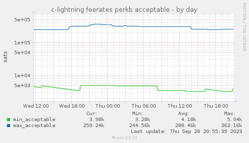

# Munin plugins for Bitcoin's c-lightning

## Installation & Configuration

1. Install jq as dependency

1. Link the `lightningd_*` scripts to `/etc/munin/plugins`.

1. If you're using SELinux, don't forget to `chcon` them properly.

1. Configure the plugins by creating a file named `/etc/munin/plugin-conf.d/bitcoind` with this content:

    ```
    [lightningd_*]
    user bitcoin
    ```

    This will tell Munin to run `lightning-cli` as the `bitcoin` user. Adapt it to your setup and avoid using `root`.

1. Restart the *munin-node* daemon with `systemctl restart munin-node` or `/etc/init.d/munin-node restart`.

1. Done. You should now start to see a new section *lightningd* in your Munin pages with the corresponding graphs.

1. After a while, images 





## License

AGPLv3+
